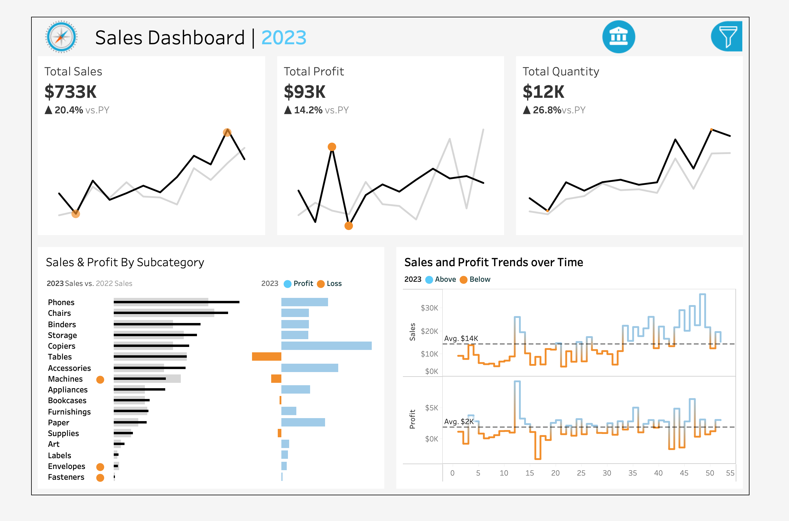
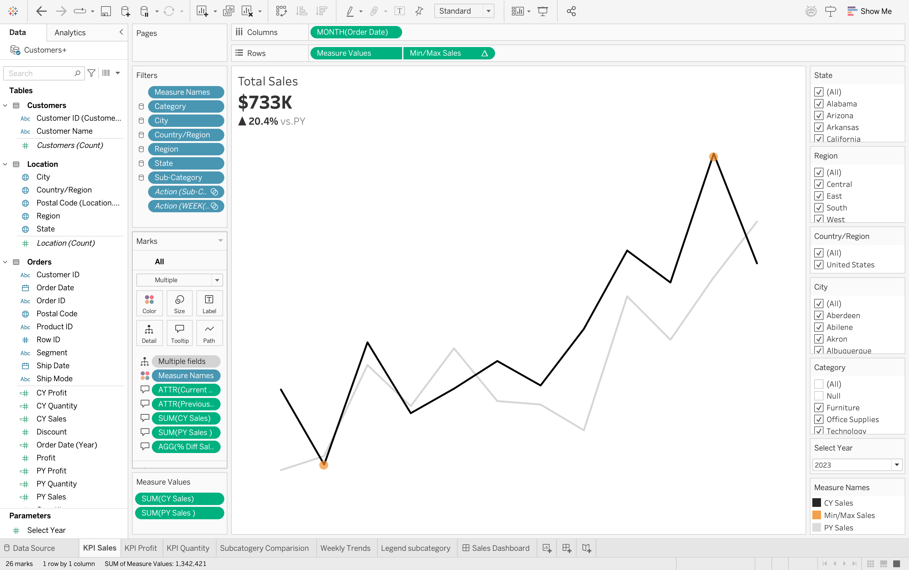
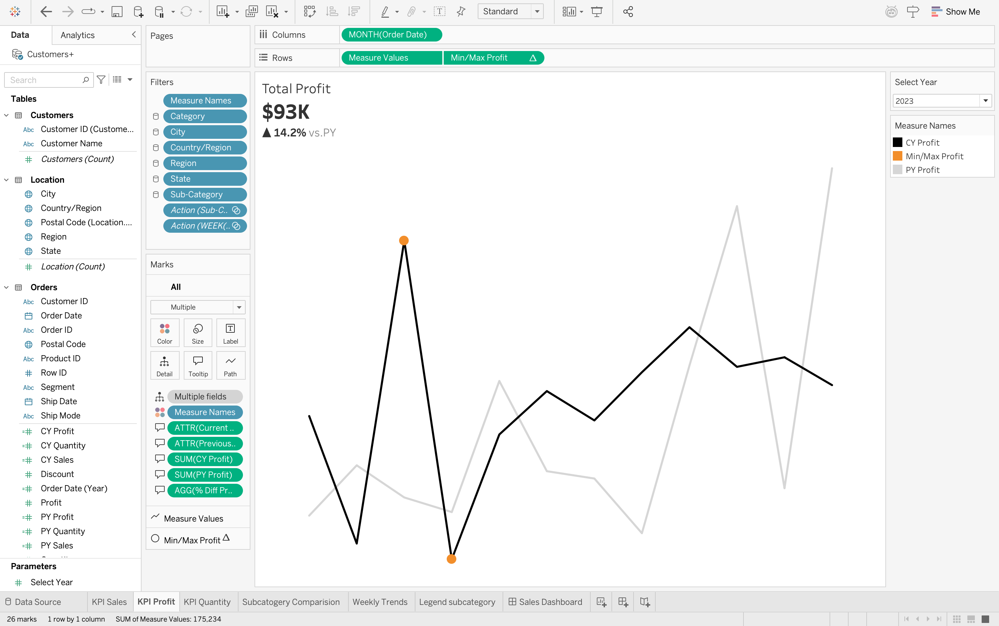
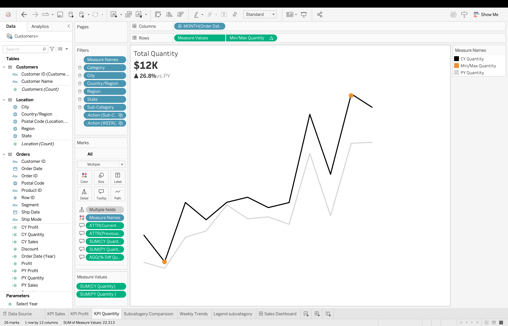

# Sales Dashboard – Tableau

Sales performance dashboard built using Tableau to analyse sales, profit, and quantity trends for the year 2023.

## Key KPIs
- Total Sales
- Total Profit
- Total Quantity
- Year-over-Year comparison
- Monthly trends
- Subcategory performance

## Dashboard Overview

## KPI – Sales

## KPI – Profit

## KPI – Quantity

## Tools Used
- Tableau
- Sample Superstore Dataset

## Author
Sanjana Harish
